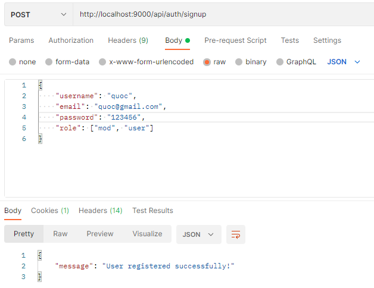

# Spring Boot JWT Authentication example with Spring Security & Spring Data JPA

#### Run docker
```
docker-compose up
```

#### Run mysql
```
insert into roles (name) values ("ROLE_USER"),("ROLE_MODERATOR"),("ROLE_ADMIN");
```

#### Signup


## User Registration, User Login and Authorization process.
The diagram shows flow of how we implement User Registration, User Login and Authorization process.


## Spring Boot Server Architecture with Spring Security
You can have an overview of our Spring Boot Server with the diagram below:


## Refresh Token


For instruction: [Spring Boot Refresh Token with JWT example](https://bezkoder.com/spring-boot-refresh-token-jwt/)